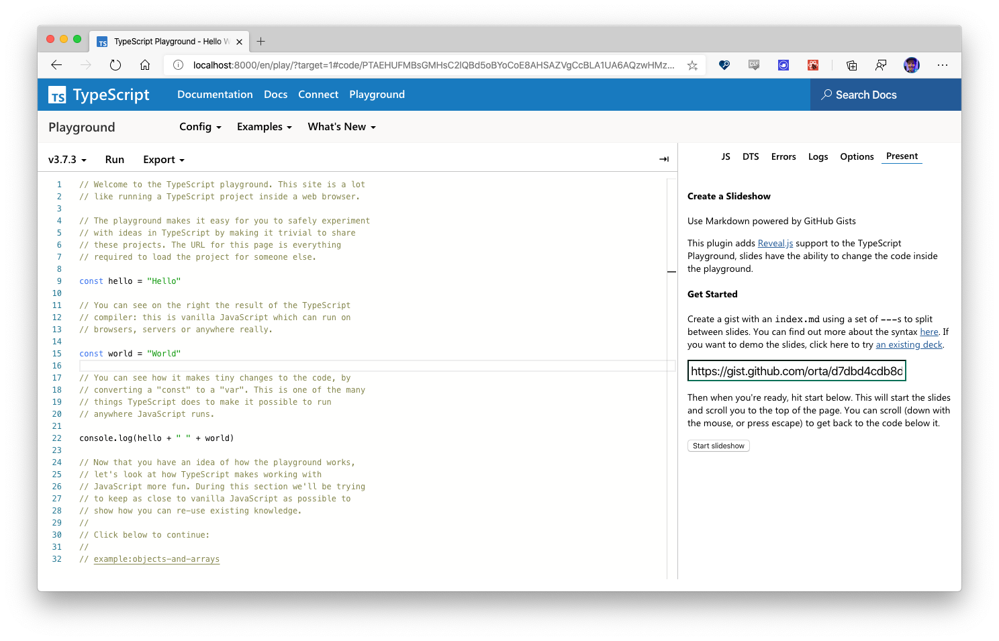
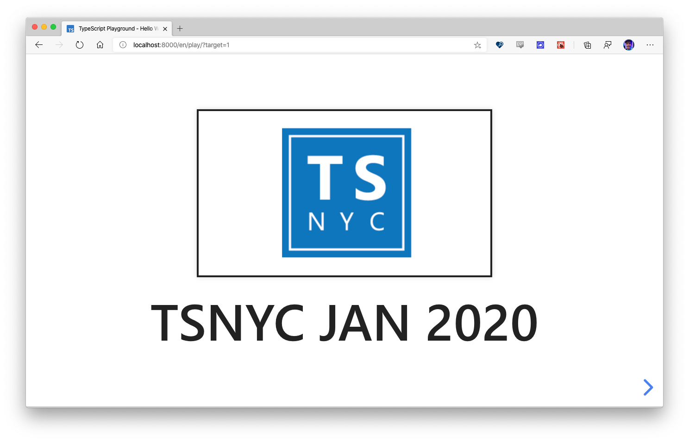
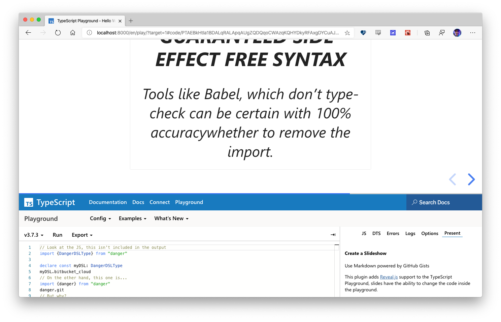

## TypeScript Playground Present

A way to present your TypeScript talk in style!

This plugin adds a copy of [Reveal.js](https://github.com/hakimel/reveal.js) above the playground, slides are created
using Markdown (via [marked](https://github.com/markedjs/marked)) and have the ability to set the text in the playground.







With markdown looking like:

```md


# TSNYC Jan 2020

---

## What is TypeScript?

TypeScript extends JavaScript by adding types.

TypeScript speeds up your development experience by catching errors and providing fixes before you even run your code.

Any browser, any OS, anywhere JavaScript runs. Entirely Open Source.

---

## Organizers

...
```

This markdown would turn into three slides.

## Examples

- [TSNY Jan 2020](./examples/tsnyc-jan-2020.md) - [gist](https://gist.github.com/orta/d7dbd4cdb8d1f99c52871fb15db620bc)
  <br>_Note: the `<playground>` element is not visible, so view the source please._

## Useful info for making slides

1. Get started by making a gist: https://gist.github.com
2. Make an `index.md` and add some example markdown
3. Split your slides with `---`
4. Save your gist, then tell the playground to load that gist

#### Playground support

You can change the playground support by putting your code inside the `<playground>` HTML element in the slides. This lets you use
markdown code blocks to show the code in the slides:

```md
# Network Requests

There are a few ways to get info from an API

---

# What is `await`?

'''ts
const response = await fetch("mysite.com/api/dogs")
'''

<playground>
import fetch from "node-fetch"

const start = await () => {
   const response = await fetch("https://mysite.com/api/dogs)
   ...
}
</playground>

---

# How do Promises work?
```

(I faked the markdown code block, it would normally use backticks, but I can't put markdown blocks in a markdown block...)

#### Built In Slides

Reveal.js supports building in a slide [using fragements](https://github.com/hakimel/reveal.js#element-attributes)

```md
# Anyone can contribute

It takes a village to make a big OSS project
---
# Extra thanks to

- Orta Therox <!-- .element: class="fragment" data-fragment-index="1" -->
- Danger McShane <!-- .element: class="fragment" data-fragment-index="2" -->

---
```

## TODO

- Make it pretty
- Add a back to slides button
- Add a down to code button when playground has changed
- Are there more things we can hook into than just code?

## Contributing

You can use `yarn start` to set up both a copy of rollup to generate the JS, and serve to host it

```sh
yarn start
```

Then set up the TypeScript playground to get a plugin from from `http://localhost:5000/index.js`.
